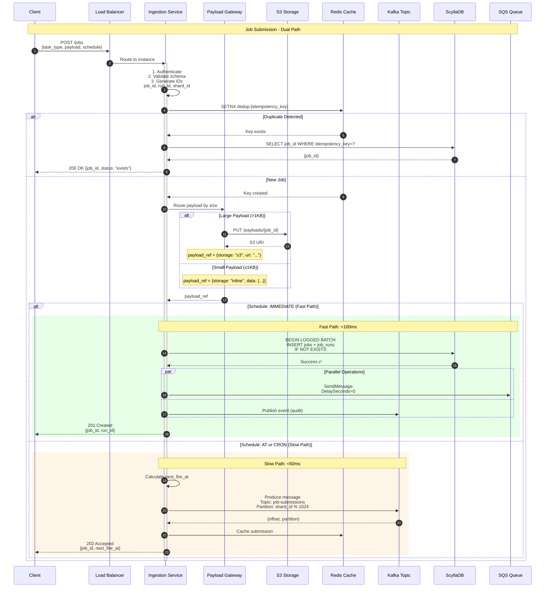

```mermaid
sequenceDiagram
    autonumber
    participant Client
    participant LB as Load Balancer
    participant API as Ingestion Service
    participant PG as Payload Gateway
    participant S3 as S3 Storage
    participant Redis as Redis Cache
    participant Kafka as Kafka Topic
    participant Scylla as ScyllaDB
    participant SQS as SQS Queue

    Note over Client,SQS: Job Submission - Dual Path

    Client->>LB: POST /jobs<br/>{task_type, payload, schedule}
    LB->>API: Route to instance
    
    activate API
    
    API->>API: 1. Authenticate<br/>2. Validate schema<br/>3. Generate IDs<br/>job_id, run_id, shard_id
    
    API->>Redis: SETNX dedup:{idempotency_key}
    
    alt Duplicate Detected
        Redis-->>API: Key exists
        API->>Scylla: SELECT job_id WHERE idempotency_key=?
        Scylla-->>API: {job_id}
        API-->>Client: 200 OK {job_id, status: "exists"}
    else New Job
        Redis-->>API: Key created
        
        API->>PG: Route payload by size
        
        alt Large Payload (>1KB)
            PG->>S3: PUT /payloads/{job_id}
            S3-->>PG: S3 URI
            Note over PG: payload_ref = {storage: "s3", uri: "..."}
        else Small Payload (≤1KB)
            Note over PG: payload_ref = {storage: "inline", data: {...}}
        end
        
        PG-->>API: payload_ref
        
        alt Schedule: IMMEDIATE (Fast Path)
            rect rgb(230, 255, 230)
                Note over API,SQS: Fast Path: <100ms
                
                API->>Scylla: BEGIN LOGGED BATCH<br/>INSERT jobs + job_runs<br/>IF NOT EXISTS
                Scylla-->>API: Success ✅
                
                par Parallel Operations
                    API->>SQS: SendMessage<br/>DelaySeconds=0
                and
                    API->>Kafka: Publish event (audit)
                end
                
                API-->>Client: 201 Created<br/>{job_id, run_id}
            end
            
        else Schedule: AT or CRON (Slow Path)
            rect rgb(255, 245, 230)
                Note over API,Kafka: Slow Path: <50ms
                
                API->>API: Calculate next_fire_at
                
                API->>Kafka: Produce message<br/>Topic: job-submissions<br/>Partition: shard_id % 1024
                Kafka-->>API: {offset, partition}
                
                API->>Redis: Cache submission
                
                API-->>Client: 202 Accepted<br/>{job_id, next_fire_at}
            end
        end
    end
    
    deactivate API
```